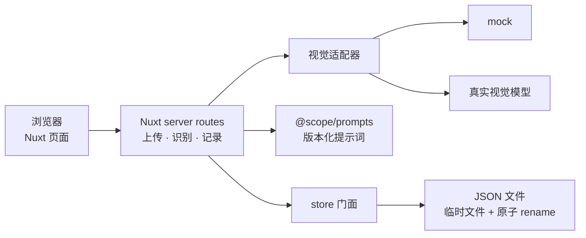

# snap2sku

服装商品录入工作台：上传商品照片，识别商品资料，确认颜色与尺码 SKU，再保存本地录入记录。

## 本地运行

需要 Node.js 与仓库锁定的 pnpm 11.19.0。克隆并安装 workspace 依赖：

```powershell
git clone https://github.com/zefra123/snap2sku.git snap2sku
cd snap2sku
pnpm install
```

Windows PowerShell 下启用无密钥演示模式并启动开发服务：

```powershell
$env:NUXT_VISION_MOCK = '1'
pnpm dev
```

打开终端显示的本地地址。添加 JPG、PNG 或 WebP 图片后点击「识别商品」。模拟场景包括照片中可读到吊牌价（`tagPrice: 399`）、未见吊牌（`tagPrice: null`），以及信息不足时全 null 结果的兜底演示。图片仍经过本地上传接口，模拟结果不会请求视觉模型。

录入流程包含图片压缩、识别结果确认、SKU 库存/价格填写和本地记录保存。W1 的商品描述由用户手动补充；流式 AI 文案属于后续阶段。

上传图片写入项目根目录的 `data/uploads/`，录入记录写入 `data/records.json`。这些目录不位于 Nuxt `public/` 下，不作为静态资源公开。

真实视觉模型模式要求仅在本机服务端配置 `NUXT_VISION_API_KEY`；也可通过 `NUXT_VISION_MODEL` 和 `NUXT_VISION_BASE_URL` 设置模型与兼容 API 地址。不要把密钥提交到仓库或发送到聊天中。

## 检查

```powershell
pnpm typecheck
pnpm build
```

## 性能基准

基准用例为 1 色 × 500 码，共渲染 500 个 SKU 行。设备为 Windows 桌面环境、Codex 内置浏览器（CPU/RAM 型号因系统权限不可读取）；矩阵渲染实测约 328.2 ms，修改首个库存值到下一帧约 17.3 ms。帧间隔采样中记录到 3 次超过 25 ms 的间隔，说明极端矩阵下有少量掉帧；普通使用应以更小的实际 SKU 规模为准。此数据是当前设备的一次本地开发环境观测，不作为跨设备性能保证。

## 架构



## 设计取舍

- **存储选 JSON + 原子写，放弃 W1 引入数据库**：当前是本地、单机、低并发原型，JSON 便于检查和备份，省去数据库运维；同目录临时文件加 `rename`，并在进程内排队，降低并发覆盖或留下半份文件的风险。数据访问统一走 `server/utils/store.ts`。
- **流程选同一工作台连续操作，放弃跨页向导**：上传、识别、确认和 SKU 编辑留在同一页面，避免跨页丢失上下文；表单和 SKU 矩阵本身较长，因此允许纵向滚动，不为字面的一屏高度压缩必要内容。PRD 的“不超过 1 屏滚动”仍需结合真实设备复核。
- **无独立置信度的字段选用 `overall`，放弃伪造字段级分数**：schema 只给 category、colors、style 独立置信度；seasons、audience、fabric、item_name、tagPrice 没有独立评分。显示 `overall` 作为统一参考，避免把其他字段的分数冒充成它们的置信度。
- **字段定义选 `packages/shared` 的 Zod schema，放弃 prompt 中手写字段清单**：prompt 在运行时从 schema 生成字段说明，减少代码与文档重复，降低字段变更后两边漂移的风险。
- **模型接入选服务端视觉适配器并保留 mock 实现，放弃业务层直连模型**：mock 是不需要 API key 的第二个实现，方便无密钥开发和复现流程；以后更换模型只需调整适配器，不必改业务调用方。

## 目录约定

- `apps/web/app/`：Nuxt 4 前端页面与唯一设计 token 文件。
- `apps/web/server/`：图片上传、识别和记录 API，以及服务端视觉模型适配器。
- `packages/shared/`：Zod schema、字段枚举和共享类型的唯一来源。
- `docs/`：产品契约、架构规划、W1 执行计划和约束。
